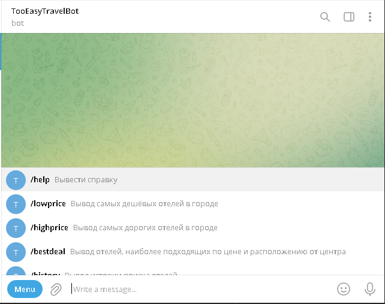

### Инструкция по эксплуатации
бота можно найти по следующей ссылке: 

https://t.me/TETravelSkillboxBot

в левом нижнем углу диалогового окна находится кнопка меню, нажатие на которую
вызовет меню с доступными командами, справа от команды есть её краткое описание, 
так же краткое описание команд появится в диалоговом окне после вызова команды
/help

После выбора команд /lowprice, /highprice и /bestdeal
бот будет вести вам по заданному сценарию, в котором вам необходимо будет указать
следующую информацию:
- В каком городе хотите найти отель
- В каком районе города хотите найти отель
- Дата заезда
- Дата отъезда
- Количество отелей(до 10 штук)
- Нужно ли выводить фотографии(до 4 фотграфий для каждого отеля)
- Минимальная и максимальная цена за ночь(Только для команды /bestdeal)
- Минимальное и максимальное расстояние до указанной достопримечательности(Только для команды /bestdeal)

Если в нашей базе данных нет информации об отелях по вашему запросу или их меньше указанного вами числа, вы получите соотвутствующее сообщение.

Вся информация о ваших запросах будет записана в нашу базу данных, и вы повторно 
можете запросить информацию о ваших последних запросах(до 10 штук) вызвав команду /history